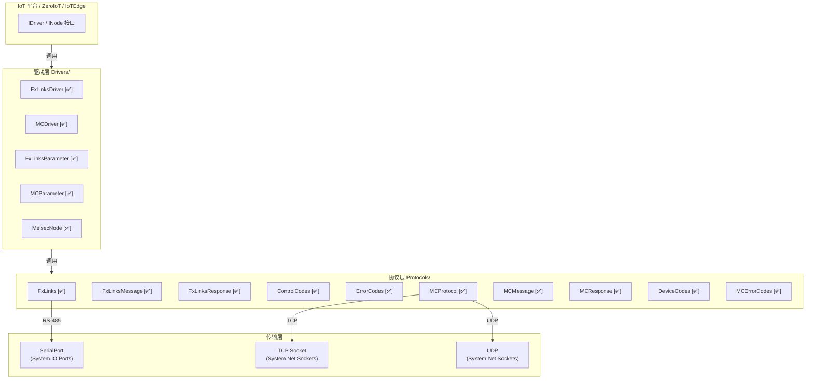
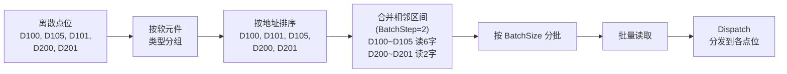
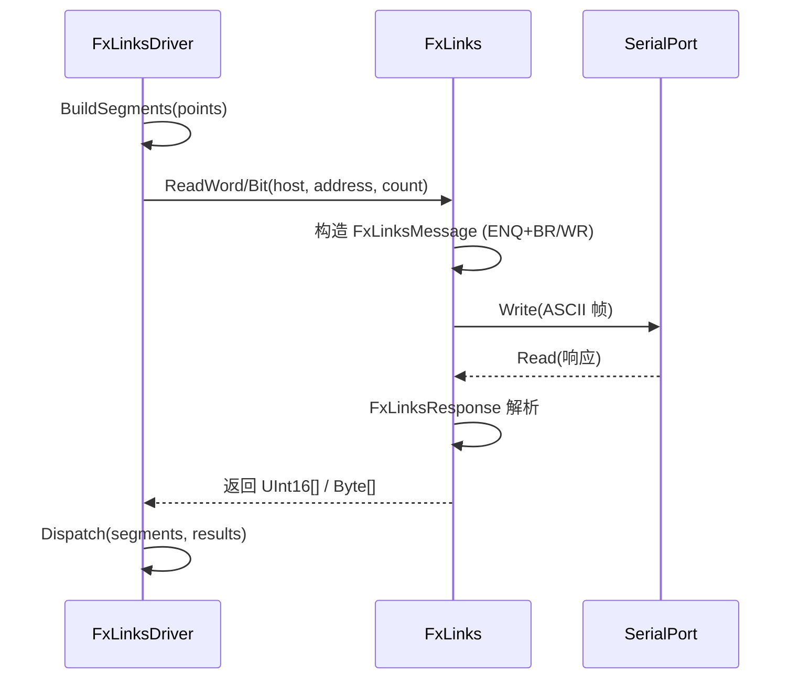
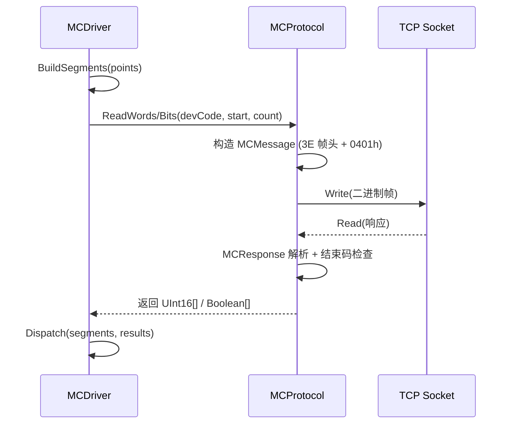

# NewLife.Melsec 架构设计

> 版本：v2.0 | 日期：2026-07-22
> 需求对应：[需求文档](需求文档.md) | 功能清单：[功能清单](功能清单.md)

## 1. 整体架构

### 1.1 分层架构

NewLife.Melsec 采用**两层架构**：驱动层（`Drivers/`）和协议层（`Protocols/`），上层通过 `IDriver` 接口与 IoT 平台对接。



**图例**：`[✅]` 已实现

**旧版（已排除编译）**：`MelsecDriver.cs` + `MelsecParameter.cs` 因依赖 HslCommunication，已从编译排除。全部功能已由 `FxLinksDriver` + `MCDriver` 纯托管替代。

### 1.2 依赖关系

```
NewLife.Melsec
  ├── NewLife.IoT    (IDriver / DriverBase / INode / IDevice / IPoint)
  ├── NewLife.Core   (DisposeBase / Pool / ITracer / ILog / Packet 等)
  └── System.IO.Ports (FxLinks 串口，netstandard2.0+ 内置)
```

---

## 2. 核心组件

### 2.1 FxLinks 协议模块

| 组件 | 所在工程 | 说明 |
|------|----------|------|
| `ControlCodes` | NewLife.Melsec.Protocols | ENQ/STX/ETX/ACK/NAK/EOT 等控制码枚举 |
| `ErrorCodes` | NewLife.Melsec.Protocols | FxLinks 协议错误码枚举 |
| `NetworkErrorCodes` | NewLife.Melsec.Protocols | 网络层错误码枚举 |
| `FxLinksMessage` | NewLife.Melsec.Protocols | FxLinks 请求帧编解码（BR/WR/BW/WW） |
| `FxLinksResponse` | NewLife.Melsec.Protocols | FxLinks 响应帧解析（STX/ACK/NAK） |
| `FxLinks` | NewLife.Melsec.Protocols | FxLinks 协议栈，串口管理与命令发送 |
| `FxLinksException` | NewLife.Melsec.Protocols | 协议异常封装 |
| `FxLinksDriver` | NewLife.Melsec.Drivers | `IDriver` 实现，批量读取分段优化 |
| `FxLinksParameter` | NewLife.Melsec.Drivers | 驱动参数（串口/站号/批量参数） |

**关键设计**：FxLinks 为 ASCII 帧格式，通过 RS-485 串口通信。校验和为从站号开始所有字节 ASCII 码累加取低 8 位。串口默认参数为 9600bps、7 数据位、偶校验、1 停止位。

### 2.2 MC 协议模块

| 组件 | 所在工程 | 说明 |
|------|----------|------|
| `DeviceCodes` | NewLife.Melsec.Protocols | MC 软元件代码枚举 + `ParseAddress` 地址解析器 |
| `MCMessage` | NewLife.Melsec.Protocols | MC 3E 帧请求编解码（二进制 + ASCII 模式） |
| `MCResponse` | NewLife.Melsec.Protocols | MC 3E 帧响应解析（结束码检查 + 字/位数据） |
| `MCProtocol` | NewLife.Melsec.Protocols | MC 协议栈（TCP/UDP/串口 + 自动重连） |
| `MCErrorCodes` | NewLife.Melsec.Protocols | 7 种结束码枚举 + MCException |
| `MC1EMessage` | NewLife.Melsec.Protocols | MC 1E 帧请求编解码（A 系列兼容） |
| `MC1EResponse` | NewLife.Melsec.Protocols | MC 1E 帧响应解析 |
| `SLMPMessage` | NewLife.Melsec.Protocols | SLMP 3C 帧请求编解码（与 MC 3E 兼容） |
| `SLMPResponse` | NewLife.Melsec.Protocols | SLMP 3C 帧响应解析 |
| `MCDriver` | NewLife.Melsec.Drivers | `IDriver` 实现，批量读取分段 + 数据转换 |
| `MCParameter` | NewLife.Melsec.Drivers | 驱动参数（IP:Port/网络号/批量参数/帧类型） |

**关键设计**：
- MC 3E 帧为二进制 Little-Endian 格式，效率高于 ASCII 模式
- 支持三种传输模式：TCP（默认）、UDP、串口（1C/3C/4C）
- 支持两种帧类型：3E 帧（Qna 兼容）、1E 帧（A 系列兼容）
- SLMP 3C 帧与 MC 3E 二进制帧完全兼容

### 2.3 公共组件

| 组件 | 所在工程 | 说明 |
|------|----------|------|
| `HexHelper` | NewLife.Melsec | 16 进制字符与字节互转工具方法 |
| `SerialTransport` | NewLife.Melsec.Drivers | 串口收发封装（异步等待、超时、粘包处理） |
| `SerialPortConfig` | NewLife.Melsec.Drivers | 串口参数 XML 持久化 |
| `MelsecNode` | NewLife.Melsec.Drivers | `INode` 通用节点模型，FxLinks/MC 共用 |

---

## 3. 驱动层设计

### 3.1 驱动架构模式

`FxLinksDriver` 和 `MCDriver` 均继承 `DriverBase` 并实现 `IDriver` 接口，结构保持一致：

1. **参数创建**：`CreateParameter()` 返回对应的参数对象
2. **连接管理**：`Open/Close` 管理协议实例生命周期，按连接键（串口名/IP:Port）唯一共享
3. **批量读取**：`BuildSegments` 将离散点位按类型分组 → 地址排序 → 相邻区间合并 → 分批
4. **结果分发**：`Dispatch` 将汇聚读取的数据按各点位相对偏移切分

### 3.2 批量读取优化算法



### 3.3 连接共享与生命周期

- **FxLinks**：按串口名（`COM3`）为唯一键，引用计数管理，多个站号共享同一串口
- **MC**：按 IP:Port（`192.168.1.10:6000`）为唯一键，引用计数管理
- 最后一个节点关闭时自动释放底层连接

---

## 4. 关键流程

### 4.1 FxLinks 批量读取



### 4.2 MC 3E 批量读取



---

## 5. 文件组织

```
NewLife.Melsec/
├── HexHelper.cs                    ← 十六进制工具方法
├── NewLife.Melsec.csproj
├── Drivers/
│   ├── FxLinksDriver.cs            ← FxLinks IDriver 实现 [✅]
│   ├── FxLinksParameter.cs         ← FxLinks 驱动参数 [✅]
│   ├── MelsecDriver.cs             ← 旧 MC 骨架 [❌ 已排除编译]
│   ├── MelsecNode.cs               ← 节点模型（两协议共用）[✅]
│   ├── MelsecParameter.cs          ← 旧参数模型 [❌ 已排除编译]
│   ├── MCDriver.cs                 ← MC IDriver 实现（含 ConvertToWords）[✅]
│   ├── MCParameter.cs              ← MC 驱动参数 [✅]
│   ├── SerialPortConfig.cs         ← 串口配置持久化 [✅]
│   └── SerialTransport.cs          ← 串口传输层 [✅]
└── Protocols/
    ├── ControlCodes.cs             ← FxLinks 控制码枚举 [✅]
    ├── ErrorCodes.cs               ← FxLinks 错误码 [✅]
    ├── FxLinks.cs                  ← FxLinks 协议栈 [✅]
    ├── FxLinksException.cs         ← FxLinks 异常类 [✅]
    ├── FxLinksMessage.cs           ← FxLinks 请求帧 [✅]
    ├── FxLinksResponse.cs          ← FxLinks 响应帧 [✅]
    ├── NetworkErrorCodes.cs        ← 网络层错误码 [✅]
    ├── DeviceCodes.cs              ← MC 软元件代码枚举 + 地址解析器 [✅]
    ├── MCMessage.cs                ← MC 3E 请求帧 [✅]
    ├── MCProtocol.cs               ← MC 协议栈（TCP/UDP/串口）[✅]
    ├── MCResponse.cs               ← MC 响应帧 [✅]
    ├── MCErrorCodes.cs             ← MC 结束码枚举 + MCException [✅]
    ├── MC1EMessage.cs              ← MC 1E 请求帧 [✅]
    ├── MC1EResponse.cs             ← MC 1E 响应帧 [✅]
    ├── MCDataFormat.cs             ← MC 数据格式定义 [✅]
    ├── MCFrameType.cs              ← MC 帧类型枚举 [✅]
    ├── SLMPDeviceCode.cs           ← SLMP 软元件代码 [✅]
    ├── SLMPMessage.cs              ← SLMP 请求帧 [✅]
    └── SLMPResponse.cs             ← SLMP 响应帧 [✅]
```

---

## 6. 设计决策

| 决策 | 选项 | 选择 | 理由 |
|------|------|------|------|
| 协议实现方式 | 纯托管 .NET / 包装 HslCommunication | 纯托管 .NET | MIT 开源，无商业授权风险；利于长期维护 |
| 帧基类 | 分开实现 / 共用基类 | 分开实现 | FxLinks（ASCII 帧）与 MC（二进制帧）差异太大，共用基类增加复杂度 |
| 驱动注册 | `[Driver]` 特性 / 工厂方法 | `[Driver]` 特性 | 遵循 NewLife.IoT 驱动注册约定 |
| 连接唯一性 | `GetKey()` 返回连接标识 / 全局单例 | `GetKey()` | 允许同进程连接多台不同 PLC |
| 批量优化 | 分组 + 地址区间合并 / 单点读取 | 分组 + 合并 | 减少通信次数，提升 10 倍以上采集效率 |
| TCP 连接管理 | 长连接 + 自动重连 / 每次短连接 | 长连接 + 自动重连 | 工厂环境频繁短连接会触发 PLC 连接数限制 |
| 帧格式选择 | 二进制模式优先 / ASCII 模式 | 二进制模式优先 | 二进制帧效率更高，Q/FX5U 系列均支持 |
| 错误处理 | 抛异常 / 返回 null | 抛异常 | 便于上层区分通信错误和协议错误 |
| 连接共享 | 按 IP:Port 唯一共享 / 每节点独立 | 按 IP:Port 共享 | 节省连接数，与 FxLinksDriver 策略一致 |
| 数据类型转换 | ConvertToWords 统一处理 / 上层自行转换 | ConvertToWords | 统一处理 Bool/Int32/Float/Double → UInt16[] |

---

## 7. 测试策略

### 7.1 测试架构

- **帧编解码测试**：基于三菱官方帧示例验证序列化/反序列化正确性
- **驱动逻辑测试**：Mock 协议层，验证 BuildSegments/Dispatch 算法
- **数据类型转换测试**：验证 ConvertToWords 各类型转换正确性
- **E2E 集成测试**：模拟 TCP 服务端，验证完整收发流程

### 7.2 测试覆盖

| 模块 | 测试文件 | 用例数 |
|------|---------|:------:|
| FxLinks 帧编解码 | FxLinksMessageTests + FxLinks485Tests | 7 |
| FxLinks 协议栈 | FxLinksTests（Mock） | 6 |
| FxLinks 驱动层 | FxLinksDriverTests | 6 |
| MC 3E 帧编解码 + 驱动 + 转换 + E2E | MCMessageTests + MCDriverTests + MCDriverConvertTests + MCIntegrationTests | 59+ |
| MC 1E 帧 | MC1ETests | 含在 MC 总数内 |
| MC ASCII 模式 | MCMessageAsciiTests + MCResponseAsciiTests | 含在 MC 总数内 |
| MC 新特性（UDP/串口/随机读/远程控制） | MCProtocolNewFeaturesTests | 含在 MC 总数内 |
| SLMP 协议 | SLMPTests | 5 |
| HexHelper | HexHelperTests | 1 |
| **总计** | | **~180** |

> 2026-07-22 执行 `dotnet test XUnitTest`，全部通过，0 失败、0 跳过。
